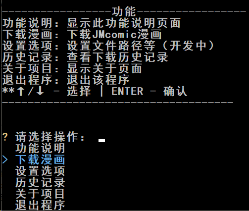

<div align="center">
   
   <h1>JMComic Downloader</h1>
   <p>基于 Python 开发的命令行漫画下载工具，提供简洁易用的交互式界面，支持批量下载、历史记录管理及多主题切换。</p><br>

[](https://www.python.org/)  [](https://github.com/Eix0721/JMcomic-Downloader/releases)  [](https://opensource.org/licenses/MIT)
[](https://github.com/Eix0721/JMcomic-Downloader/releases) [](https://github.com/Eix0721/JMcomic-Downloader/commits/main)


</div>

---

## ✨ 特性

<div align="center">

| 🚀 **快速开始** | 🎮 **交互友好** | 🎯 **批量下载** | 🎨 **多种主题**|
|:--------------:|:--------------:|:--------------:|:-------------:|
| 下载即用，无需配置 | 优雅的交互式菜单 | 支持多个漫画ID |内置 7 种界面风格 |
| 📜 **历史记录** | 🌐 **域名测试** | ⚙️ **配置持久** | 🛠️ **异常处理**|
| 自动保存下载轨迹 | 智能检测可用域名 | 自动生成 yml 配置 | 详尽的报错提示 |

</div>


## 🚀 快速开始

- ### **📦 推荐方式 - 即开即用**

1. **下载程序** 
   - 前往 [Release](https://github.com/Eix0721/JMcomic-Downloader/releases/latest)页面
   - 在底部下载最新版本的<ruby>可执行文件<rp>(</rp><rt>**.exe**</rt><rp>)</rp> </ruby>

2. **运行程序**
   下载完成后后双击运行 "JMcomic_Downloader.exe"
- ### 🛠️ 源码运行

1. **克隆项目**
   ```bash
   git clone https://github.com/Eix0721/JMcomic-Downloader.git
   ```

2. **安装依赖**
   ```bash
   pip install -r src\requirements.txt
   ```

3. **运行程序**
   ```bash
   python src\jmcomic_downloader.py
   ```


## 🎮 使用指南

- #### 主菜单
   - <br>
   - 启动程序后，通过 **`↑/↓`** 选择功能，按 **`ENTER`** 键确认：

- #### 下载漫画
  - 选择 **`下载漫画`**，输入禁漫车号（如：`350234`）。
  - 支持**批量下载**：多个车号用空格分隔（如：`350234 114514`）。
  - 下载完成后，漫画将保存至与**漫画同名的文件夹内**，记录会自动同步至`history.yml`。

- #### 设置选项
  - **下载日志输出**：开启后可查看详细的下载进度条和网络请求日志。
  - **切换主题**：内置“商务深蓝”、“粉红樱花”、“赛博霓虹”等多种配色。
  - **测试连接**：自动获取并测试多个禁漫域名，寻找当前网络环境下最快的线路。
  - **恢复默认**：一键重置所有配置文件。


## 📂 项目结构

```
Jmcomic-Downloader\
│  README.md            # 项目说明
│  .gitignore           # Git 忽略文件
│  Changelog            # 更新日志
│  LICENSE              # MIT许可证
├─assets\
│   │ func_demo_1_20260219.png # 功能演示图
│   └─ icon.ico                 # 程序图标
└─src\
    │  jmcomic_downloader.py  # 程序入口
    │  requirements.txt       # 依赖列表
    ├─libs\
    │   ├─self\               # 项目核心模块
    │   │   │  core.py        # 主下载逻辑与命令分发
    │   │   │  ui.py          # 基于 InquirerPy 的交互界面
    │   │   │  text.py        # 静态文本与多套主题配置
    │   │   │  config.py      # 配置管理类 (SimpSave封装)
    │   │   │  history.py     # 历史记录管理类
    │   │   │  test_domain.py # 域名可用性检测工具
    │   │   └─ __init__.py
    └─...
```


## 🛠️ 技术栈&鸣谢
感谢以下开源项目：
<div align="center">

| 技术&模块 | 用途 | 
|------|------|
| **[JMComic Crawler Python](https://github.com/hect0x7/JMComic-Crawler-Python)** | 核心下载引擎 | 
| **[InquirerPy](https://github.com/kazhala/InquirerPy)** | 交互式命令行 UI | 
| **[SimpSave](https://github.com/Water-Run/SimpSave)** | 极简 YAML 配置存取 | 
| **[curl_cffi](https://github.com/yifeikong/curl_cffi)** | 绕过网络指纹检测 | 

</div>

- **关爱禁漫娘，请不要一次性内下载过多本子!**


## 🔔 其他事项
- 本项目目前仍在**初步开发阶段**。欢迎您提交 [Issue](https://github.com/Eix0721/JMcomic-Downloader/issues/new) 或 [PR](https://github.com/Eix0721/JMcomic-Downloader/compare) 参与改进！
- 采用 [MIT 许可证](https://opensource.org/licenses/MIT) 开源。

> 版权所有 © 2025 Eix0721

<br>
<a href="https://www.star-history.com/#Eix0721/JMcomic-Downloader&type=date&legend=top-left">
 <picture>
   <source media="(prefers-color-scheme: dark)" srcset="https://api.star-history.com/svg?repos=Eix0721/JMcomic-Downloader&type=date&theme=dark&legend=top-left" />
   <source media="(prefers-color-scheme: light)" srcset="https://api.star-history.com/svg?repos=Eix0721/JMcomic-Downloader&type=date&legend=top-left" />
   
 </picture>
</a>
<div align="center">
如果这个项目对你有帮助，给个 ⭐Star⭐ 支持一下吧！
<div>